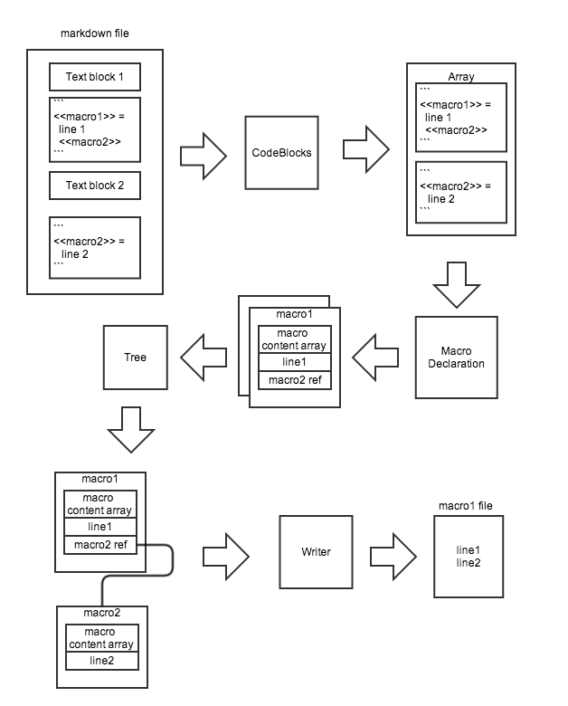

MDLP: MarkDown Literate Programing 
==================================

The first step is to parse the files to extract all the code blocks. Each code blocks content is parsed into a macro declaration (`<<name>>`). A MacroDeclaration contains code and reference to other macro declaration. Then the flat collection of all macro declaration is analyzed to create a tree with all referenced resolved. A code writer travel through the macro tree and write source code files.

See this diagram for high level idea of module separation:



code blocks
-----------

  The file parse by mdlp is a standard markdown file. All the literate programing element are contains in code blocks. We can either use four spaces at the front of each lines or fenced code blocks ` ``` `. In both case, the code blocks need to have a blank line before.

``` 
<<code_blocks_parser>> = 
	while( line_index < line_count ) {
		// search for a blank line
 		if( IsEmptyLine(lines[line_index]) ) {
			// look if the next line is a beginning of code blocks
			line_index++;
			if( IsFencedDelimitor(lines[line_index]) ) {
				<<fenced_code_blocks>>
			} else if( StartW4Spaces(lines[line_index]) ) {
				<<four_spaces_code_blocks>>
     		}
     	}
     line_index++;
     }
```

### Fenced code blocks

First we jump to the next line ( first line of code block) and until we find the closing fenced, we push lines into the block. In case of fenced code blocks, we coud have an error if we don't have the closing ` ``` `. If we reach the end of file before the closing fenced, we print an error. 

```
<<fenced_code_blocks>> =
	var lineNumber = line_index + 1;
	var block = [];
	// advance to the next line
	line_index++;
	while( line_index < line_count && !IsFencedDelimitor(lines[line_index]) ) {
		block.push(lines[line_index]);
		line_index++;
	}

	<<fenced_code_blocks_error_or_callback>>
```

### 4 spaces

```
<<four_spaces_code_blocks>> =
	var lineNumber = line_index;
	var block = [];
	while( line_index < line_count && StartW4Spaces(lines[line_index]) ) {
		block.push(lines[line_index]);
		line_index++;
	}

	// go back to the last line of the block
	line_index--;

	callback(block, lineNumber, filename);
```

Macro declaration
-----------------
A macro declaration object has a name parse from `<<macro name>> (+)=` line. All below lines are MacroContent object: a CodeLine or a macro reference.

```
<<macro-declaration-object>> =
	this.Name = "";
	/**
	 * This array contains objects of type MacroContent.
	 */
	this.MacroContentArray = [];
	/**
	 * If the macro is declared with '=', this is not a concatenation.
	 * '+=' => concatenation
	 */
	this.Concatenate = false;
	
	this.Filename = "";
	
	this.Linenumber = 0;
```

### Parse

A code blocks not always contains a macro declaration. If a code block contains a macro declaration, it begins with `<<`.

```
<<contains_macro_declaration>> =
	function ContainsMacroDeclaration(lines) {
		return (/^[ \t]*<<[^<]/).test(lines[0]);
	}
```

First we verify that the line array contains a code block.

```
<<check-contain-macro>> =
	if(!ContainsMacroDeclaration(lines)) {
		return null;
	}
```

Then parse the first line to extract the macro declaration name.

```
<<parse-macro-declaration-header>> =
	/**
	 * return {name: "", concatenate: false/true}, null if error happends
	 */
	function ParseMacroDeclarationHeader(l, lineNumber, filename) {
		var result = {};
		var r = (/<<.*>>/).exec(l);
		
		<<parse-macro-declaration-header-error1>>
		
		result.name = ExtractMacroName(r[0]);
		
		<<parse-macro-declaration-header-error2>>
		
		l = l.substring(r.index + r[0].length);;
		
		var affectationRegex = /^\s*=\s*$/;
		var additionRegex = /^\s*\+=\s*$/;
		
		if(affectationRegex.test(l)) {
			result.concatenate = false;
		} else if(additionRegex.test(l)) {
			result.concatenate = true;
		}
		
		<<parse-macro-declaration-header-error3>>
		return result;
	}
``` 
Now each further lines can't have specific error. In a first pass we create macro content objects for each line and we detect at spaces baseline the minimum.

```
<<extract-macro-content>> =
	var baselineSpaces = Number.MAX_VALUE;
	for(var i = lineStart; i < lines.length; i++) {
		var l = lines[i];
		var lTrim = l.trim();
		var indent = ReadIndentLevel(l);
		var mc = new MacroContent(lTrim, indent, lineNumber + i, filename);
		md.MacroContentArray.push(mc);
		// empty lines don't participate in baseline
		if(lTrim.length > 0) {
			baselineSpaces = (indent < baselineSpaces)? indent : baselineSpaces;
		}
	}
```

In the first pass we register the raw indentation level. Now we correct the indentation level relatively to the baseline.

```
<<extract-macro-content>> +=
	for(var i = 0; i < md.MacroContentArray.length; i++) {
		var mc = md.MacroContentArray[i];
		mc.Indent = (mc.Indent < baselineSpaces)? baselineSpaces : mc.Indent - baselineSpaces;
	}
```

Macro content
-------------

The Macro Content Object detect automatically if the line is source code or a macro reference.

```
<<macro-content-object>> =
function MacroContent(content, indent, lineNumber, filename) {
	this.Indent = indent;
	this.LineNumber = lineNumber;
	this.Filename = filename;
	
	var mName = ExtractMacroName(content);
	if(mName != "") {
		this.IsMacroReference = true;
		this.Name = mName;
		this.Ref = null;
	} else {
		this.IsMacroReference = false;
		this.Code = content;
	}
}
```

Tree
----

The goal of this module is to take a flat array of Macro Declaration and to construct a tree.

The first is to travel through the macro array and to merge all the macro declaration with the same name.
As the algorithm need to find a macro by his name, we transform the macro array into a hashmap.

```
<<construct-tree-body>> =
	var mergedArray = macroArray.slice();
	var macroMap = {};
	for(var i = 0; i < macroArray.length; i++) {
		var m = macroArray[i];
		if(m.Name in macroMap) {
			// merge process
			var originMacro = macroMap[m.Name];
			if(m.Concatenate) {
				var index = mergedArray.indexOf(m);
				if(index != -1){
					mergedArray.splice(index, 1);
				}
				originMacro.MergeWith(m);
			} else {
				success = false;
				console.error(m.Filename + ":" + m.Linenumber + "Macro " + m.Name + " was already defined " + originMacro.Filename + ":" + originMacro.Linenumber);
			}
		} else {
			if(!m.Concatenate) {
				macroMap[m.Name] = m;
			} else {
				success = false;
				console.error(m.Filename + ":" + m.Linenumber + ": " + m.Name + " has no declaration before.");
			}
		}
	}
```

To merge a macro declaration b into a, we just concatenate the macro content array of a with macro content array of b.
This function is related only to Macro Declaration. We implement it as a protoype.

```
<<macro-declaration-prototype>> =
	MergeWith: function(m) {
		for(var i = 0; i < m.MacroContentArray.length; i++) {
			this.MacroContentArray.push(m.MacroContentArray[i]);
		}
	}
```

Now that macro declaration are merged, we resolve reference. At the beginning, all the macro declaration are candidate to be root. At same time that we merge macro declaration, we keep only the first macro declaration of the same name as candidate in the root array.
When a macro declaration become child of another we remove it from the root list.

```
<<construct-tree-body>> += 
	var rootArray = mergedArray.slice();
	for(var i = 0; i < mergedArray.length; i++) {
		// search for child reference
		var m = mergedArray[i];
		for(var j = 0; j < m.MacroContentArray.length; j++) {
			var mc = m.MacroContentArray[j];
			if(mc.IsMacroReference) {
				if(mc.Name in macroMap) {
					mc.Ref = macroMap[mc.Name];
					var index = rootArray.indexOf(mc.Ref);
					if(index != -1){
						rootArray.splice(index, 1);
					}
				} else {
					console.warn(mc.Filename + ":" + mc.lineNumber + " can't find macro declaration " + mc.Name);
				}
			}
		}
	}
	
	return (success)? rootArray : null;
```

Writer
------
Travel through all the tree with Depth-first pre-order traversal and concatenate all the code string. 

```
<<flat-tree-body>> =
	var lines = [];
	function traverse(node, indent) {
		if(comment != null) {
			var s = "";
            for(var j = 0; j < indent; j++) {
                s += " ";
            }
            s += comment + " <<" + node.Name + ">> ( " + node.Filename + ":" + node.Linenumber + " )";

			lines.push(s);
		}
		for(var i = 0; i < node.MacroContentArray.length; i++) {
			var c = node.MacroContentArray[i];
			if(c.IsMacroReference) {
				if("Ref" in c && c.Ref != null) {
					traverse(c.Ref, indent + c.Indent);
				} else {
					lines.push("<<" + c.Name + ">>");
				}
			} else {
				// indent the line
				var s = "";
                for(var j = 0; j < indent + c.Indent; j++) {
                    s += " ";
                }
				lines.push(s + c.Code);
			}
		}
	}
	traverse(root, 0);
	return lines;
```

Appendix
========

code blocks module
------------------

```
<<./lib/CodeBlocks.js>> =

	// less than 4 spaces
	function IsEmptyLine(l) {
		return (/^ ? ? ?\r?$/).test(l);
	}
	
	function IsFencedDelimitor(l) {
		return (/^```\s*$/).test(l);
	}
	
	function StartW4Spaces(l) {
		return (/^(    |\t)/).test(l);
	}

	/**
	 * Take an array of line and search for code blocks. Each time a code blocks is find, this function
	 * create an array of lines with the code blocks content. The callback is call for each code blocks
	 * with the line array of the code blocks and his start line.
	 * callback = function(lines, lineNumber, filename);
	 * return true if no error happened.
	 */ 
	function CodeBlocksParse(lines, callback, filename) {
		var success = true;
		var line_index = 0;
		var line_count = lines.length;
		<<code_blocks_parser>>
		
		return success;
	}
	
	module.exports.CodeBlocksParse = CodeBlocksParse;
```

```
<<fenced_code_blocks_error_or_callback>> =
	if(line_index == line_count) {
		// we reach the end of the file without closing fenced code blocks
		success = false;
		console.error("Line " + line_index + ": No closing fenced code blocks until the end of file.");
	} else {
		// no error
		callback(block, lineNumber, filename);
	}
```

Macro declaration module
------------------------

```
<<parse-macro-declaration-header-error1>> =
	if(r == null) {
		console.error(filename + ":" + lineNumber + ": Lack \">>\" in the macro declaration");
		return null;
	}
```

```
<<parse-macro-declaration-header-error2>> =
	if(result.name == "") {
		console.error(filename + ":" + lineNumber + ": macro declaration name contains illegal character");
		return null;
	}
```

```
<<parse-macro-declaration-header-error3>> =
	else {
		r = (/\+?=/).exec(l);
		if(r == null) {
			console.error(filename + ":" + lineNumber + ": No affectation operator (+?=)");
		} else if(line.substring(0, resR.index).trim().length != 0) {
			console.error(filename + ":" + lineNumber + ": Unexpected character before affectation operator (+?=)");
		} else if(line.substring(resR.index + resR[0].length).trim().length != 0) {
			console.error(filename + ":" + lineNumber + ": Unexpected character after affectation operator (+?=)");
		} else {
			console.error(filename + ":" + lineNumber + ": Unexpected error");
		}
		return null;
	}
```

```
<<./lib/MacroDeclaration.js>> =
	<<contains_macro_declaration>>

	function ReadIndentLevel(l) {
		var spaces = 0;
		var whiteStartRes = (/^( |\t)*/).exec(l);
		if(whiteStartRes) {
			var whiteStart = whiteStartRes[0];
			var wsRes = whiteStart.match(/ /g);
			var tabRes = whiteStart.match(/\t/g);
			var wsCount = (wsRes != null)? wsRes.length : 0;
			var tabCount = (tabRes != null)? tabRes.length : 0;
			spaces = wsCount + tabCount * 4;
		}
		return spaces;
	}

	/**
	 * This take a string like "<<name>>" and extract the name component.
	 * If the definition is illegal this fonction return an empty string.
	 * n.b: this function print no error
	 */
	function ExtractMacroName(content) {
		var r = (/^<<[\w :\-\.\/]+>>$/).exec(content);
		if(r == null) {
			return "";
		}
		return r[0].substr(r.index + 2, r[0].length - 4);
	}

	<<parse-macro-declaration-header>>
	
	<<macro-content-object>>

	function MacroDeclaration() {
		<<macro-declaration-object>>
	}
	
	MacroDeclaration.prototype = {
		<<macro-declaration-prototype>>
	}

	/**
	 * Extract maco content from lines after the macro header.
	 */
	function ExtractMacroContent(lineStart, lines, lineNumber, filename, name, concatenate) {
		var md = new MacroDeclaration();
		md.Filename = filename;
		md.Linenumber = lineNumber;
		md.Name = name;
		md.Concatenate = concatenate;

		<<extract-macro-content>>
		return md;
	}

	/**
	 * Take code block content and return a MacroDeclaration object.
	 * Return null if an error happen.
	 */
	function ParseMacroDeclaration(lines, lineNumber, filename) {
		<<check-contain-macro>>
		
		var headerInfo = ParseMacroDeclarationHeader(lines[0], lineNumber, filename);
		if(headerInfo == null) {
			return null;
		}
		
		var md = ExtractMacroContent(1, lines, lineNumber, filename, headerInfo.name, headerInfo.concatenate);

		if(md.MacroContentArray.length == 0) {
			console.error(filename + ":" + lineNumber + ": macro declaration is empty");
		}
		
		return md;
	}

	module.exports.ParseMacroDeclaration = ParseMacroDeclaration;
	module.exports.ExtractMacroContent   = ExtractMacroContent;
```

Tree Module
-----------

```
<<./lib/Tree.js>> =
	function ConstructTree(macroArray) {
		var success = true;
		<<construct-tree-body>>
	}
	
	module.exports.ConstructTree = ConstructTree;
```

Writer Module
-------------

```
<<./lib/Writer.js>> =
	var fs = require('fs')
      , path = require('path');
  
	function EnsurePathExist(filePath) {
		var folder = path.dirname(filePath);
		var stackFolder = [];
		while(!fs.existsSync(folder)) {
			stackFolder.push(folder);
			folder = path.dirname(folder);
		}
		for(var i = stackFolder.length - 1; i >= 0; i--) {
			var f = stackFolder[i];
			fs.mkdirSync(f);
		}
	}
	
	function IsPathInSandbox(sandboxFolder, filePath) {
		var sandboxFolderR = path.resolve(sandboxFolder);
		var pathR = path.resolve(filePath);
		return pathR.search(sandboxFolderR) != -1;
	}
	
	/**
	 * Take a macro declaration tree and flat it into a array of line
	 */
	function FlatTree(root, comment) {
		<<flat-tree-body>>
	}
	
	function WriteTree(rootArray, outputFolder, comment) {
		var success = true;
		var absoluteOutputFolder = path.resolve(outputFolder);
		if(!fs.existsSync(absoluteOutputFolder)) {
			console.error("Output folder " + absoluteOutputFolder + " dosn't exist");
			return false;
		}
		for(var i = 0; i < rootArray.length; i++) {
			var rootNode = rootArray[i];
			var filePath = path.resolve(absoluteOutputFolder, rootNode.Name);
			if(!(/^\./).test(rootNode.Name)) {
				console.error(rootNode.Filename + ":" + rootNode.Linenumber + ": If " + rootNode.Name + " is a root macro declaration, his name should begin with a '.' else a macro reference to it is lacking");
				success = false;
				continue;
			}
			if(!IsPathInSandbox(absoluteOutputFolder, filePath)) {
				console.error(filePath + " is outside the output folder");
				success = false;
				continue;
			}

			var flatContentArray = FlatTree(rootNode, comment);
			
			EnsurePathExist(filePath);
			fs.writeFileSync(filePath, flatContentArray.join("\n"));
		}
		return success;
	}
	
	module.exports.WriteTree = WriteTree;
```

MDLP module
-----------

```
<<./lib/mdlp.js>> =
var codeBlocks = require('./CodeBlocks.js')
  , macroDeclaration = require('./MacroDeclaration.js')
  , tree = require('./Tree.js')
  , writer = require('./Writer.js')
  , fs = require('fs')
  , path = require('path');
  
function ExtractSourceCode(inputFilesArray, outputFolder, comment) {
	var success = true;
	
	// extract macro declaration
	var macroDeclarationArray = [];
	for(var i = 0; i < inputFilesArray.length; i++) {
		var inputFile = inputFilesArray[i];
		var b = path.basename(inputFile);
		var ext = path.extname(b);

		if(!fs.existsSync(inputFile)) {
			console.error(inputFile + " doesn't exist");
			success = false;
			continue;
		}
		var fileContent = fs.readFileSync(inputFile, 'utf8');

		if(ext == ".mdlp") {
			var rootName = path.basename(b, ".mdlp");
			var md = macroDeclaration.ExtractMacroContent(0, fileContent.split("\n"), 0, inputFile, "::" + rootName, false);
			if(md == null) {
				success = false;
			} else {
				macroDeclarationArray.push(md);
			}
		} else {
			codeBlocks.CodeBlocksParse(fileContent.split("\n"), function(lines, lineNumber, filename) {
				var md = macroDeclaration.ParseMacroDeclaration(lines, lineNumber, filename);
				if(md == null) {
					success = false;
				} else {
					macroDeclarationArray.push(md);
				}
			}, inputFile);
		}
	}
	
	// create tree
	var rootArray = tree.ConstructTree(macroDeclarationArray);
	if(rootArray != null) {
		// write source code
		writer.WriteTree(rootArray, outputFolder, comment);
	} else {
		console.error("generation stopped after some error in the tree");
	}
}

module.exports.ExtractSourceCode = ExtractSourceCode;
```
